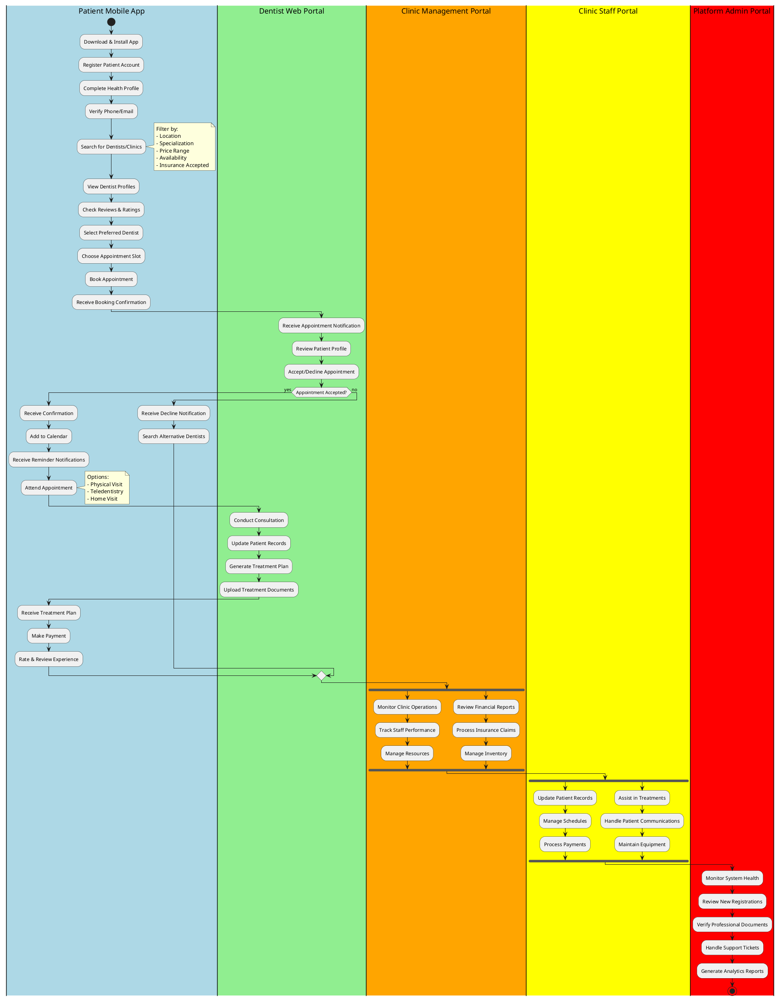

# SereneAI-Web Comprehensive System Diagrams

Dokumentasi lengkap untuk sistem manajemen klinik dental SereneAI-Web yang mencakup Web Admin Portal, Web Clinic Portal, Web Dentist Portal, dan Mobile Patient App dengan role-based access control yang komprehensif.

## 1. Use Case Diagram - Complete System Overview

```plantuml
@startuml SereneAI_Complete_UseCase_Diagram

!theme aws-orange
!define RECTANGLE class

' Actors with clear role definitions
actor "Patient\n(Mobile App)" as P #lightblue
actor "Independent Dentist\n(Web Portal)" as ID #lightgreen
actor "Clinic Staff Dentist\n(Web Portal)" as CD #lightgreen
actor "Clinic Owner\n(Web Portal)" as CO #orange
actor "Clinic Manager\n(Web Portal)" as CM #orange
actor "Front Office Staff\n(Web Portal)" as FO #yellow
actor "Nurse\n(Web Portal)" as N #yellow
actor "Cashier\n(Web Portal)" as CA #yellow
actor "Platform Admin\n(Web Portal)" as PA #red
actor "Super Admin\n(Web Portal)" as SA #darkred
actor "Customer Support\n(Web Portal)" as CS #pink

' Mobile Patient App Features
package "Mobile Patient App" {
  usecase "Register as Patient" as M1
  usecase "Login to Mobile App" as M2
  usecase "Search Dentists & Clinics" as M3
  usecase "View Dentist Profiles" as M4
  usecase "Book Appointment" as M5
  usecase "Cancel/Reschedule Appointment" as M6
  usecase "View Appointment History" as M7
  usecase "Rate & Review Dentist" as M8
  usecase "Upload Medical Records" as M9
  usecase "Chat with Dentist" as M10
  usecase "Pay for Services" as M11
  usecase "Track Treatment Progress" as M12
  usecase "Receive Notifications" as M13
  usecase "Emergency Dental Services" as M14
  usecase "Insurance Claim Submission" as M15
}

' Web Authentication System
package "Web Authentication System" {
  usecase "Professional Registration" as W1
  usecase "Web Portal Login" as W2
  usecase "Role-Based Dashboard Access" as W3
  usecase "Password Management" as W4
  usecase "Profile Management" as W5
  usecase "Avatar & Document Upload" as W6
}

' Independent Dentist Portal
package "Independent Dentist Web Portal" {
  usecase "Complete Professional Registration" as D1
  usecase "Upload Professional Documents" as D2
  usecase "Manage Practice Profile" as D3
  usecase "Set Consultation Fees" as D4
  usecase "Manage Availability Schedule" as D5
  usecase "View Patient Appointments" as D6
  usecase "Conduct Teledentistry Sessions" as D7
  usecase "Access Patient Records" as D8
  usecase "Generate Treatment Reports" as D9
  usecase "Manage Professional Network" as D10
  usecase "Financial Dashboard" as D11
}

' Clinic Staff Portal
package "Clinic Staff Web Portal" {
  usecase "Register as Clinic Staff" as C1
  usecase "Staff Role Assignment" as C2
  usecase "Branch Assignment" as C3
  usecase "Access Clinic Dashboard" as C4
  usecase "Manage Clinic Patients" as C5
  usecase "Schedule Management" as C6
  usecase "Staff Communication" as C7
  usecase "Clinic Resource Management" as C8
  usecase "Performance Reporting" as C9
}

' Clinic Management Portal
package "Clinic Management Web Portal" {
  usecase "Create Clinic Profile" as CM1
  usecase "Manage Multiple Branches" as CM2
  usecase "Staff Recruitment & Management" as CM3
  usecase "Invite Staff Members" as CM4
  usecase "Assign Staff Permissions" as CM5
  usecase "Monitor Clinic Operations" as CM6
  usecase "Financial Management" as CM7
  usecase "Clinic Analytics Dashboard" as CM8
  usecase "Equipment & Inventory Management" as CM9
  usecase "Marketing & Promotions" as CM10
}

' Platform Administration
package "Platform Administration Portal" {
  usecase "Verify Dentist Applications" as A1
  usecase "Review Professional Documents" as A2
  usecase "Approve/Reject Registrations" as A3
  usecase "Manage Platform Users" as A4
  usecase "System Analytics & Reporting" as A5
  usecase "Content Management" as A6
  usecase "Platform Configuration" as A7
  usecase "Compliance Monitoring" as A8
  usecase "Revenue Management" as A9
  usecase "Customer Support Tools" as A10
}

' Document & File Management
package "Document Management System" {
  usecase "Professional Document Upload" as Doc1
  usecase "PDF Document Viewing" as Doc2
  usecase "Document Verification" as Doc3
  usecase "File Storage Management" as Doc4
  usecase "Medical Record Management" as Doc5
  usecase "Compliance Documentation" as Doc6
}

' Communication & Notification System
package "Communication System" {
  usecase "In-App Messaging" as Comm1
  usecase "Email Notifications" as Comm2
  usecase "SMS Notifications" as Comm3
  usecase "Push Notifications" as Comm4
  usecase "Appointment Reminders" as Comm5
  usecase "System Announcements" as Comm6
}

' ===== MOBILE PATIENT APP RELATIONSHIPS =====
P --> M1
P --> M2
P --> M3
P --> M4
P --> M5
P --> M6
P --> M7
P --> M8
P --> M9
P --> M10
P --> M11
P --> M12
P --> M13
P --> M14
P --> M15

' ===== INDEPENDENT DENTIST WEB PORTAL RELATIONSHIPS =====
ID --> W1
ID --> W2
ID --> W3
ID --> W4
ID --> W5
ID --> W6
ID --> D1
ID --> D2
ID --> D3
ID --> D4
ID --> D5
ID --> D6
ID --> D7
ID --> D8
ID --> D9
ID --> D10
ID --> D11
ID --> Doc1
ID --> Doc2
ID --> Doc5
ID --> Comm1
ID --> Comm2

' ===== CLINIC STAFF DENTIST WEB PORTAL RELATIONSHIPS =====
CD --> W1
CD --> W2
CD --> W3
CD --> W4
CD --> W5
CD --> W6
CD --> C1
CD --> C2
CD --> C3
CD --> C4
CD --> C5
CD --> C6
CD --> C7
CD --> D6
CD --> D7
CD --> D8
CD --> D9
CD --> Doc1
CD --> Doc2
CD --> Doc5
CD --> Comm1
CD --> Comm7

' ===== CLINIC OWNER WEB PORTAL RELATIONSHIPS =====
CO --> W1
CO --> W2
CO --> W3
CO --> W4
CO --> W5
CO --> W6
CO --> CM1
CO --> CM2
CO --> CM3
CO --> CM4
CO --> CM5
CO --> CM6
CO --> CM7
CO --> CM8
CO --> CM9
CO --> CM10
CO --> C4
CO --> C5
CO --> C6
CO --> C7
CO --> C8
CO --> C9
CO --> Doc4
CO --> Doc6
CO --> Comm1
CO --> Comm2
CO --> Comm6

' ===== CLINIC MANAGER WEB PORTAL RELATIONSHIPS =====
CM --> W2
CM --> W3
CM --> W4
CM --> W5
CM --> W6
CM --> CM2
CM --> CM3
CM --> CM4
CM --> CM5
CM --> CM6
CM --> CM7
CM --> CM8
CM --> CM9
CM --> C4
CM --> C5
CM --> C6
CM --> C7
CM --> C8
CM --> C9
CM --> Doc4
CM --> Doc6
CM --> Comm1
CM --> Comm6

' ===== FRONT OFFICE STAFF WEB PORTAL RELATIONSHIPS =====
FO --> W2
FO --> W3
FO --> W4
FO --> W5
FO --> W6
FO --> C1
FO --> C4
FO --> C5
FO --> C6
FO --> C7
FO --> M5
FO --> M6
FO --> M7
FO --> Doc5
FO --> Comm1
FO --> Comm5

' ===== NURSE WEB PORTAL RELATIONSHIPS =====
N --> W2
N --> W3
N --> W4
N --> W5
N --> W6
N --> C1
N --> C4
N --> C5
N --> C7
N --> C8
N --> D8
N --> Doc5
N --> Comm1
N --> Comm7

' ===== CASHIER WEB PORTAL RELATIONSHIPS =====
CA --> W2
CA --> W3
CA --> W4
CA --> W5
CA --> W6
CA --> C1
CA --> C4
CA --> CM7
CA --> M11
CA --> M15
CA --> Comm1

' ===== PLATFORM ADMIN WEB PORTAL RELATIONSHIPS =====
PA --> W2
PA --> W3
PA --> A1
PA --> A2
PA --> A3
PA --> A4
PA --> A5
PA --> A6
PA --> A7
PA --> A8
PA --> A9
PA --> A10
PA --> Doc2
PA --> Doc3
PA --> Doc4
PA --> Comm6

' ===== SUPER ADMIN WEB PORTAL RELATIONSHIPS =====
SA --> W2
SA --> W3
SA --> A1
SA --> A2
SA --> A3
SA --> A4
SA --> A5
SA --> A6
SA --> A7
SA --> A8
SA --> A9
SA --> A10
SA --> CM1
SA --> CM2
SA --> CM3
SA --> CM4
SA --> CM5
SA --> Doc2
SA --> Doc3
SA --> Doc4
SA --> Comm6

' ===== CUSTOMER SUPPORT WEB PORTAL RELATIONSHIPS =====
CS --> W2
CS --> W3
CS --> A4
CS --> A10
CS --> Comm1
CS --> Comm2
CS --> Comm3
CS --> Comm4

' ===== INCLUDE RELATIONSHIPS =====
D1 ..> D2 : <<include>>
D1 ..> Doc1 : <<include>>
A1 ..> A2 : <<include>>
A1 ..> Doc3 : <<include>>
CM3 ..> CM4 : <<include>>
CM3 ..> CM5 : <<include>>
M5 ..> M3 : <<include>>
M5 ..> M4 : <<include>>
C1 ..> C2 : <<include>>
C1 ..> C3 : <<include>>

' ===== EXTEND RELATIONSHIPS =====
D2 ..> Doc1 : <<extend>>
A2 ..> Doc2 : <<extend>>
W5 ..> W6 : <<extend>>
M9 ..> Doc5 : <<extend>>
M10 ..> Comm1 : <<extend>>
M13 ..> Comm4 : <<extend>>

@enduml
```



## 2. Activity Diagram - Complete Patient Journey & Clinic Operations



## 3. Sequence Diagram - Multi-Platform Appointment Booking Process

```plantuml
@startuml SereneAI_MultiPlatform_Sequence_Diagram

participant "Patient\n(Mobile App)" as PA
participant "Mobile API\nGateway" as MAG
participant "Clinic Staff\n(Web Portal)" as CS
participant "Dentist\n(Web Portal)" as DW
participant "Backend API" as BE
participant "Database" as DB
participant "Notification\nService" as NS
participant "Payment\nGateway" as PG

== Patient Appointment Booking ==
PA -> MAG: Search dentists with filters
activate MAG
MAG -> BE: GET /v1/mobile/dentists/search
activate BE
BE -> DB: Query verified dentists
activate DB
DB --> BE: Return dentist list
deactivate DB
BE --> MAG: Return filtered dentists
deactivate BE
MAG --> PA: Display dentist profiles
deactivate MAG

PA -> MAG: Select dentist & time slot
activate MAG
MAG -> BE: GET /v1/mobile/dentists/{id}/availability
activate BE
BE -> DB: Check dentist schedule
activate DB
DB --> BE: Available time slots
deactivate DB
BE --> MAG: Return availability
deactivate BE
MAG --> PA: Show available slots
deactivate MAG

PA -> MAG: Book appointment
activate MAG
MAG -> BE: POST /v1/mobile/appointments/book
activate BE

BE -> BE: Validate appointment data
BE -> DB: Check slot availability
activate DB
DB --> BE: Slot still available
deactivate DB

BE -> DB: Create appointment record
activate DB
DB --> BE: Appointment created
deactivate DB

== Multi-Channel Notifications ==
BE -> NS: Send notifications
activate NS

par Notify Dentist
  NS -> DW: Web push notification
  NS -> DW: Email notification
and Notify Clinic Staff
  NS -> CS: Dashboard notification
  NS -> CS: SMS notification  
and Confirm to Patient
  NS -> PA: Mobile push notification
  NS -> PA: SMS confirmation
end

deactivate NS
BE --> MAG: Appointment confirmed
deactivate BE
MAG --> PA: Show confirmation
deactivate MAG

== Dentist Response (Web Portal) ==
DW -> BE: GET /v1/web/dentist/appointments/pending
activate BE
BE -> DB: Fetch pending appointments
activate DB
DB --> BE: Pending appointments list
deactivate DB
BE --> DW: Display pending appointments
deactivate BE

DW -> BE: POST /v1/web/dentist/appointments/{id}/respond
activate BE
BE -> DB: Update appointment status
activate DB
DB --> BE: Status updated
deactivate DB

alt Appointment Accepted
  BE -> NS: Send acceptance notifications
  activate NS
  NS -> PA: "Appointment Confirmed"
  NS -> CS: Update clinic schedule
  deactivate NS
  
  == Payment Processing ==
  BE -> PG: Initialize payment
  activate PG
  PG --> BE: Payment token
  deactivate PG
  BE -> NS: Send payment link
  activate NS
  NS -> PA: Payment notification
  deactivate NS
  
else Appointment Declined
  BE -> NS: Send decline notifications
  activate NS
  NS -> PA: "Appointment Declined - Reason"
  NS -> PA: Suggest alternative dentists
  deactivate NS
end

BE --> DW: Response processed
deactivate BE

== Clinic Staff Portal Integration ==
CS -> BE: GET /v1/web/clinic/appointments/today
activate BE
BE -> DB: Fetch clinic appointments
activate DB
DB --> BE: Today's appointments
deactivate DB
BE --> CS: Display appointments
deactivate BE

CS -> BE: POST /v1/web/clinic/appointments/{id}/checkin
activate BE
BE -> DB: Update appointment status
activate DB
DB --> BE: Check-in recorded
deactivate DB
BE -> NS: Notify dentist
activate NS
NS -> DW: Patient checked in
deactivate NS
BE --> CS: Check-in confirmed
deactivate BE

== Error Handling ==
alt Database Error
  DB --> BE: Connection timeout
  BE --> MAG: Service unavailable
  MAG --> PA: "Please try again later"
else Payment Failure
  PG --> BE: Payment declined
  BE -> NS: Payment failure notification
  NS -> PA: "Payment failed - Try different method"
else Slot Conflict
  DB --> BE: Slot no longer available
  BE --> MAG: Booking conflict
  MAG --> PA: "Slot taken - Choose another time"
end

@enduml
```

## 4. Sequence Diagram - Dentist Registration & Admin Verification Flow

@startuml SereneAI_DentistRegistration_Sequence

participant "Independent Dentist\n(Web Portal)" as ID
participant "Clinic Staff Dentist\n(Web Portal)" as CD
participant "Clinic Owner\n(Web Portal)" as CO
participant "Web Frontend" as WF
participant "Backend API" as BE
participant "File Storage" as FS
participant "Database" as DB
participant "Platform Admin\n(Web Portal)" as PA
participant "Notification Service" as NS

== Independent Dentist Registration ==
ID -> WF: Access registration form
activate WF
WF -> WF: Load registration interface
WF --> ID: Display form fields
deactivate WF

ID -> WF: Fill personal & professional info
activate WF
ID -> WF: Upload documents (SIP, STR, Education, Certificates)
ID -> WF: Upload avatar image
ID -> WF: Submit registration

WF -> BE: POST /v1/auth/register (dentist)
activate BE
BE -> BE: Validate form data
BE -> FS: Store uploaded documents
activate FS
FS --> BE: Document URLs returned
deactivate FS
BE -> DB: Create user account
activate DB
BE -> DB: Create dentist profile
BE -> DB: Store document references
DB --> BE: Registration successful
deactivate DB

BE -> NS: Send confirmation email
activate NS
NS --> ID: Registration confirmation
deactivate NS

BE --> WF: Registration success response
deactivate BE
WF --> ID: Show success message & pending status
deactivate WF

== Clinic Staff Dentist Registration ==
CD -> CO: Request to join clinic
activate CO
CO -> WF: Access staff management
activate WF
WF -> BE: GET /v1/clinic/profile
activate BE
BE -> DB: Fetch clinic details
activate DB
DB --> BE: Clinic information
deactivate DB
BE --> WF: Clinic data
deactivate BE
WF --> CO: Display clinic management dashboard
deactivate WF

CO -> WF: Invite dentist to clinic
activate WF
WF -> BE: POST /v1/clinic/staff/invite
activate BE
BE -> NS: Send invitation email
activate NS
NS --> CD: Invitation with registration link
deactivate NS
BE --> WF: Invitation sent
deactivate BE
WF --> CO: Confirmation message
deactivate WF
deactivate CO

CD -> WF: Click invitation link & register
activate WF
WF -> WF: Pre-fill clinic information
CD -> WF: Complete registration form
CD -> WF: Upload professional documents
CD -> WF: Submit clinic staff registration

WF -> BE: POST /v1/auth/register (clinic-staff)
activate BE
BE -> FS: Store documents
activate FS
FS --> BE: Document URLs
deactivate FS
BE -> DB: Create user account
activate DB
BE -> DB: Create dentist profile
BE -> DB: Create clinic staff assignment
BE -> DB: Link to clinic & branch
DB --> BE: Clinic staff registration complete
deactivate DB
BE --> WF: Registration successful
deactivate BE
WF --> CD: Success with pending verification status
deactivate WF

== Admin Verification Process ==
BE -> NS: Notify admin of new application
activate NS
NS -> PA: New dentist application notification
deactivate NS

PA -> WF: Access admin verification portal
activate WF
WF -> BE: GET /v1/admin/dentists/pending
activate BE
BE -> DB: Fetch pending applications
activate DB
DB --> BE: Pending dentist list
deactivate DB
BE --> WF: Display pending applications
deactivate BE
WF --> PA: Show verification queue
deactivate WF

PA -> WF: Select dentist application for review
activate WF
WF -> BE: GET /v1/admin/dentists/{id}/details
activate BE
BE -> DB: Fetch dentist profile & documents
activate DB
DB --> BE: Complete dentist information
deactivate DB
BE --> WF: Dentist details
deactivate BE
WF --> PA: Display application details
deactivate WF

PA -> WF: View professional documents
activate WF
WF -> BE: GET /v1/admin/dentists/{id}/documents/{type}
activate BE
BE -> FS: Retrieve document file
activate FS
FS --> BE: Document stream
deactivate FS
BE --> WF: PDF document
deactivate BE
WF -> WF: Display PDF in modal viewer
WF --> PA: Show document for review
deactivate WF

PA -> WF: Review all documents and information
PA -> WF: Make verification decision

alt Approve Application
  PA -> WF: Click approve button
  activate WF
  WF -> BE: POST /v1/admin/dentists/{id}/verify (action: approve)
  activate BE
  BE -> DB: Update dentist status to 'verified'
  activate DB
  BE -> DB: Record approval details
  DB --> BE: Status updated
  deactivate DB

  BE -> NS: Send approval notifications
  activate NS
  par Notify Dentist
    NS -> ID: "Application Approved" email
    NS -> CD: "Application Approved" email
  else Notify Clinic Owner (if clinic staff)
    NS -> CO: "Staff dentist approved" notification
  end
  deactivate NS

  BE --> WF: Approval successful
  deactivate BE
  WF --> PA: Show success message
  deactivate WF

else Reject Application
  PA -> WF: Click reject button & provide reason
  activate WF
  WF -> BE: POST /v1/admin/dentists/{id}/verify (action: reject, reason)
  activate BE
  BE -> DB: Update dentist status to 'rejected'
  activate DB
  BE -> DB: Store rejection reason
  DB --> BE: Status updated
  deactivate DB

  BE -> NS: Send rejection notifications
  activate NS
  NS -> ID: "Application Rejected" email with reason
  NS -> CD: "Application Rejected" email with reason
  deactivate NS

  BE --> WF: Rejection processed
  deactivate BE
  WF --> PA: Show rejection confirmation
  deactivate WF
end

== Post-Verification Access ==
alt Approved Dentist Login
  ID -> WF: Login with credentials
  activate WF
  WF -> BE: POST /v1/auth/login
  activate BE
  BE -> DB: Verify credentials & status
  activate DB
  DB --> BE: Verified dentist account
  deactivate DB
  BE --> WF: Login successful with full access
  deactivate BE
  WF --> ID: Redirect to dentist dashboard
  deactivate WF

else Rejected Dentist Login Attempt
  ID -> WF: Login with credentials
  activate WF
  WF -> BE: POST /v1/auth/login
  activate BE
  BE -> DB: Check account status
  activate DB
  DB --> BE: Account rejected
  deactivate DB
  BE --> WF: Login blocked - account rejected
  deactivate BE
  WF --> ID: Show rejection message & resubmission option
  deactivate WF
end

@enduml


## 5. Sequence Diagram - Clinic Staff Management & Role Assignment

@startuml SereneAI_ClinicStaffManagement_Sequence

participant "Clinic Owner\n(Web Portal)" as CO
participant "Clinic Manager\n(Web Portal)" as CM
participant "Front Office Staff\n(Web Portal)" as FO
participant "Nurse\n(Web Portal)" as N
participant "Cashier\n(Web Portal)" as CA
participant "Web Frontend" as WF
participant "Backend API" as BE
participant "Database" as DB
participant "Email Service" as ES
participant "SMS Service" as SS

== Clinic Owner Creates Clinic Profile ==
CO -> WF: Register clinic account
activate WF
WF -> BE: POST /v1/auth/register (clinic-owner)
activate BE
BE -> DB: Create clinic owner account
activate DB
BE -> DB: Create clinic profile
DB --> BE: Clinic created successfully
deactivate DB
BE --> WF: Registration successful
deactivate BE
WF --> CO: Show clinic setup wizard
deactivate WF

CO -> WF: Complete clinic profile setup
activate WF
CO -> WF: Add clinic details, branches, services
WF -> BE: PUT /v1/clinic/profile
activate BE
BE -> DB: Update clinic information
activate DB
DB --> BE: Profile updated
deactivate DB
BE --> WF: Profile save successful
deactivate BE
WF --> CO: Clinic profile complete
deactivate WF

== Multi-Branch Setup ==
CO -> WF: Create additional branches
activate WF
WF -> BE: POST /v1/clinic/branches
activate BE
BE -> DB: Create branch records
activate DB
DB --> BE: Branches created
deactivate DB
BE --> WF: Branches setup complete
deactivate BE
WF --> CO: Multi-branch clinic ready
deactivate WF

== Staff Recruitment Process ==
CO -> WF: Access staff management
activate WF
WF -> WF: Display staff dashboard
WF --> CO: Show current staff & invite options
deactivate WF

CO -> WF: Invite clinic manager
activate WF
WF -> BE: POST /v1/clinic/staff/invite
activate BE
BE -> DB: Create invitation record
activate DB
DB --> BE: Invitation created
deactivate DB
BE -> ES: Send invitation email
activate ES
ES --> CM: Invitation email with registration link
deactivate ES
BE --> WF: Invitation sent
deactivate BE
WF --> CO: Manager invitation sent
deactivate WF

== Staff Registration & Role Assignment ==
CM -> WF: Click invitation link
activate WF
WF -> WF: Pre-populate clinic information
WF --> CM: Display registration form
deactivate WF

CM -> WF: Complete registration
activate WF
WF -> BE: POST /v1/auth/register (clinic-manager)
activate BE
BE -> DB: Create manager account
activate DB
BE -> DB: Assign to clinic with manager role
BE -> DB: Set branch assignments
BE -> DB: Configure permissions
DB --> BE: Manager account created
deactivate DB
BE --> WF: Registration successful
deactivate BE
WF --> CM: Login to clinic portal
deactivate WF

== Manager Invites Additional Staff ==
CM -> WF: Access staff management
activate WF
WF -> BE: GET /v1/clinic/staff
activate BE
BE -> DB: Fetch current staff
activate DB
DB --> BE: Staff list
deactivate DB
BE --> WF: Display staff directory
deactivate BE
WF --> CM: Show staff management interface
deactivate WF

par Front Office Staff Invitation
  CM -> WF: Invite front office staff
  activate WF
  WF -> BE: POST /v1/clinic/staff/invite (role: front_office)
  activate BE
  BE -> ES: Send invitation
  activate ES
  ES --> FO: Front office invitation
  deactivate ES
  BE --> WF: Invitation sent
  deactivate BE
  WF --> CM: Front office staff invited
  deactivate WF
else Nurse Invitation
  CM -> WF: Invite nurse
  activate WF
  WF -> BE: POST /v1/clinic/staff/invite (role: nurse)
  activate BE
  BE -> ES: Send invitation
  activate ES
  ES --> N: Nurse invitation
  deactivate ES
  BE --> WF: Invitation sent
  deactivate BE
  WF --> CM: Nurse invited
  deactivate WF
else Cashier Invitation
  CM -> WF: Invite cashier
  activate WF
  WF -> BE: POST /v1/clinic/staff/invite (role: cashier)
  activate BE
  BE -> ES: Send invitation
  activate ES
  ES --> CA: Cashier invitation
  deactivate ES
  BE --> WF: Invitation sent
  deactivate BE
  WF --> CM: Cashier invited
  deactivate WF
end

== Staff Registration with Role-Based Access ==
FO -> WF: Register as front office staff
activate WF
WF -> BE: POST /v1/auth/register (front-office)
activate BE
BE -> DB: Create staff account with permissions
activate DB
note right of DB
  Permissions:
  - Patient management
  - Appointment scheduling
  - Basic reporting
  - Reception duties
end note
DB --> BE: Front office account created
deactivate DB
BE --> WF: Registration successful
deactivate BE
WF --> FO: Access granted to front office features
deactivate WF

N -> WF: Register as nurse
activate WF
WF -> BE: POST /v1/auth/register (nurse)
activate BE
BE -> DB: Create nurse account with permissions
activate DB
note right of DB
  Permissions:
  - Patient care records
  - Clinical assistance
  - Treatment support
  - Medical documentation
end note
DB --> BE: Nurse account created
deactivate DB
BE --> WF: Registration successful
deactivate BE
WF --> N: Access granted to clinical features
deactivate WF

CA -> WF: Register as cashier
activate WF
WF -> BE: POST /v1/auth/register (cashier)
activate BE
BE -> DB: Create cashier account with permissions
activate DB
note right of DB
  Permissions:
  - Payment processing
  - Billing management
  - Insurance claims
  - Financial reporting
end note
DB --> BE: Cashier account created
deactivate DB
BE --> WF: Registration successful
deactivate BE
WF --> CA: Access granted to financial features
deactivate WF

== Role-Based Dashboard Access ==
FO -> WF: Login to clinic portal
activate WF
WF -> BE: GET /v1/clinic/dashboard (front-office)
activate BE
BE -> DB: Fetch front office data
activate DB
DB --> BE: Patient schedules, appointments, reception tasks
deactivate DB
BE --> WF: Front office dashboard data
deactivate BE
WF --> FO: Display reception & scheduling interface
deactivate WF

N -> WF: Login to clinic portal
activate WF
WF -> BE: GET /v1/clinic/dashboard (nurse)
activate BE
BE -> DB: Fetch nursing data
activate DB
DB --> BE: Patient care records, clinical tasks, treatment schedules
deactivate DB
BE --> WF: Nursing dashboard data
deactivate BE
WF --> N: Display clinical support interface
deactivate WF

CA -> WF: Login to clinic portal
activate WF
WF -> BE: GET /v1/clinic/dashboard (cashier)
activate BE
BE -> DB: Fetch financial data
activate DB
DB --> BE: Payment records, billing, insurance claims
deactivate DB
BE --> WF: Financial dashboard data
deactivate BE
WF --> CA: Display billing & payment interface
deactivate WF

== Dynamic Permission Management ==
CO -> WF: Modify staff permissions
activate WF
WF -> BE: PUT /v1/clinic/staff/{id}/permissions
activate BE
BE -> DB: Update staff permissions
activate DB
DB --> BE: Permissions updated
deactivate DB
BE -> SS: Notify staff of permission changes
activate SS
SS --> FO: Permission update notification
SS --> N: Permission update notification
SS --> CA: Permission update notification
deactivate SS
BE --> WF: Permissions updated successfully
deactivate BE
WF --> CO: Staff permissions modified
deactivate WF

== Branch Assignment & Transfer ==
CM -> WF: Assign staff to different branches
activate WF
WF -> BE: PUT /v1/clinic/staff/{id}/branch
activate BE
BE -> DB: Update branch assignment
activate DB
DB --> BE: Branch assignment updated
deactivate DB
BE --> WF: Staff transferred successfully
deactivate BE
WF --> CM: Branch assignment complete
deactivate WF

@enduml


## 6. Sequence Diagram - Patient Mobile App Journey with Cross-Platform Integration

```plantuml
@startuml SereneAI_PatientMobileApp_Sequence

participant "Patient\n(Mobile App)" as P
participant "Mobile App\nFrontend" as MAF
participant "Push Notification\nService" as PNS
participant "Mobile API\nGateway" as MAG
participant "Backend Services" as BS
participant "Database" as DB
participant "Payment Gateway" as PG
participant "SMS Service" as SMS
participant "Front Office\n(Web Portal)" as FO
participant "Dentist\n(Web Portal)" as D
participant "Clinic System\n(Web Portal)" as CS

== Patient App Installation & Registration ==
P -> MAF: Download & install app
activate MAF
MAF -> MAF: Initialize app components
MAF --> P: Show welcome screen
deactivate MAF

P -> MAF: Start registration process
activate MAF
MAF -> MAF: Display registration form
MAF --> P: Patient registration interface
deactivate MAF

P -> MAF: Fill registration details
activate MAF
P -> MAF: Upload profile photo
P -> MAF: Add emergency contacts
P -> MAF: Submit registration

MAF -> MAG: POST /v1/mobile/auth/register
activate MAG
MAG -> BS: Process patient registration
activate BS
BS -> DB: Create patient account
activate DB
BS -> DB: Store medical profile
BS -> DB: Configure app preferences
DB --> BS: Patient account created
deactivate DB
BS -> SMS: Send verification code
activate SMS
SMS --> P: Verification SMS
deactivate SMS
BS --> MAG: Registration initiated
deactivate BS
MAG --> MAF: Verification required
deactivate MAG
MAF --> P: Enter verification code
deactivate MAF

P -> MAF: Enter SMS verification code
activate MAF
MAF -> MAG: POST /v1/mobile/auth/verify
activate MAG
MAG -> BS: Verify patient account
activate BS
BS -> DB: Activate patient account
activate DB
DB --> BS: Account verified
deactivate DB
BS --> MAG: Verification successful
deactivate BS
MAG --> MAF: Account activated
deactivate MAG
MAF --> P: Registration complete - access granted
deactivate MAF

== Dentist Search & Profile Browsing ==
P -> MAF: Search for dentists
activate MAF
MAF -> MAF: Show search interface with filters
MAF --> P: Display search options
deactivate MAF

P -> MAF: Apply filters (location, specialization, price)
activate MAF
MAF -> MAG: GET /v1/mobile/dentists/search
activate MAG
MAG -> BS: Search verified dentists
activate BS
BS -> DB: Query dentist profiles with filters
activate DB
DB --> BS: Matching dentist list
deactivate DB
BS --> MAG: Filtered dentist results
deactivate BS
MAG --> MAF: Dentist search results
deactivate MAG
MAF --> P: Display dentist profiles with ratings
deactivate MAF

P -> MAF: View dentist profile details
activate MAF
MAF -> MAG: GET /v1/mobile/dentists/{id}/profile
activate MAG
MAG -> BS: Fetch detailed dentist profile
activate BS
BS -> DB: Get dentist information, reviews, availability
activate DB
DB --> BS: Complete dentist profile
deactivate DB
BS --> MAG: Dentist profile data
deactivate BS
MAG --> MAF: Profile information
deactivate MAG
MAF --> P: Show detailed dentist profile
deactivate MAF

== Appointment Booking Process ==
P -> MAF: Select "Book Appointment"
activate MAF
MAF -> MAG: GET /v1/mobile/dentists/{id}/availability
activate MAG
MAG -> BS: Check dentist availability
activate BS
BS -> DB: Query available time slots
activate DB
DB --> BS: Available appointments
deactivate DB
BS --> MAG: Time slot options
deactivate BS
MAG --> MAF: Available booking slots
deactivate MAG
MAF --> P: Display available times
deactivate MAF

P -> MAF: Select preferred time slot
activate MAF
P -> MAF: Add appointment details & symptoms
P -> MAF: Confirm booking request

MAF -> MAG: POST /v1/mobile/appointments/book
activate MAG
MAG -> BS: Process appointment booking
activate BS
BS -> DB: Create appointment record
activate DB
BS -> DB: Reserve time slot
DB --> BS: Appointment booked
deactivate DB

== Multi-Platform Notification System ==
BS -> PNS: Send booking notifications
activate PNS
par Patient Notification
  PNS -> MAF: Push notification
  MAF --> P: "Appointment request sent"
and Dentist Notification
  PNS -> D: Web notification
  note right of D: Dentist receives instant notification\nin web portal dashboard
and Clinic Staff Notification
  PNS -> FO: Dashboard update
  note right of FO: Front office sees new appointment\nin clinic management system
end
deactivate PNS

BS -> SMS: Send SMS confirmations
activate SMS
SMS --> P: Appointment request SMS
SMS --> D: New appointment SMS
deactivate SMS

BS --> MAG: Booking request submitted
deactivate BS
MAG --> MAF: Appointment pending confirmation
deactivate MAG
MAF --> P: Show booking confirmation & pending status
deactivate MAF

== Dentist Response via Web Portal ==
D -> CS: Access dentist dashboard
activate CS
CS -> BS: GET /v1/web/dentist/appointments/pending
activate BS
BS -> DB: Fetch pending appointments
activate DB
DB --> BS: Pending appointment list
deactivate DB
BS --> CS: Display pending requests
deactivate BS
CS --> D: Show appointment requests
deactivate CS

D -> CS: Review patient information
activate CS
D -> CS: Accept appointment request
CS -> BS: POST /v1/web/appointments/{id}/confirm
activate BS
BS -> DB: Update appointment status
activate DB
DB --> BS: Appointment confirmed
deactivate DB

BS -> PNS: Send confirmation notifications
activate PNS
PNS -> MAF: Push notification
MAF --> P: "Appointment confirmed"
PNS -> FO: Update clinic schedule
deactivate PNS

BS -> SMS: Send confirmation SMS
activate SMS
SMS --> P: Appointment confirmation with details
deactivate SMS

BS --> CS: Appointment confirmed
deactivate BS
CS --> D: Confirmation processed
deactivate CS

== Payment Processing ==
BS -> PG: Initialize payment request
activate PG
PG --> BS: Payment session created
deactivate PG

BS -> PNS: Send payment notification
activate PNS
PNS -> MAF: Payment required notification
deactivate PNS

MAF --> P: Payment notification received
P -> MAF: Open payment interface
activate MAF
MAF -> MAG: GET /v1/mobile/payments/methods
activate MAG
MAG -> BS: Fetch saved payment methods
activate BS
BS -> DB: Get patient payment methods
activate DB
DB --> BS: Payment methods list
deactivate DB
BS --> MAG: Available payment options
deactivate BS
MAG --> MAF: Payment methods
deactivate MAG
MAF --> P: Display payment options
deactivate MAF

P -> MAF: Select payment method & pay
activate MAF
MAF -> MAG: POST /v1/mobile/payments/process
activate MAG
MAG -> PG: Process payment
activate PG
PG -> PG: Validate payment details
PG --> MAG: Payment successful
deactivate PG
MAG -> BS: Update payment status
activate BS
BS -> DB: Record payment transaction
activate DB
DB --> BS: Payment recorded
deactivate DB
BS --> MAG: Payment complete
deactivate BS
MAG --> MAF: Payment confirmation
deactivate MAG
MAF --> P: Payment successful - appointment confirmed
deactivate MAF

== Appointment Day - Check-in Process ==
P -> MAF: Arrive at clinic - check in via app
activate MAF
MAF -> MAG: POST /v1/mobile/appointments/{id}/checkin
activate MAG
MAG -> BS: Process patient check-in
activate BS
BS -> DB: Update appointment status
activate DB
DB --> BS: Check-in recorded
deactivate DB

BS -> PNS: Notify clinic staff
activate PNS
PNS -> FO: Patient checked in notification
PNS -> D: Patient arrival notification
deactivate PNS

BS --> MAG: Check-in successful
deactivate BS
MAG --> MAF: Check-in confirmed
deactivate MAG
MAF --> P: Checked in - please wait for dentist
deactivate MAF

== Post-Appointment Experience ==
D -> CS: Complete appointment & treatment
activate CS
CS -> BS: POST /v1/web/appointments/{id}/complete
activate BS
BS -> DB: Update appointment & treatment records
activate DB
DB --> BS: Appointment completed
deactivate DB
BS --> CS: Treatment recorded
deactivate BS
CS --> D: Appointment finalized
deactivate CS

BS -> PNS: Send completion notification
activate PNS
PNS -> MAF: Treatment complete notification
deactivate PNS

MAF --> P: Appointment completed notification
P -> MAF: Rate & review experience
activate MAF
MAF -> MAG: POST /v1/mobile/reviews/submit
activate MAG
MAG -> BS: Process review & rating
activate BS
BS -> DB: Store patient review
activate DB
DB --> BS: Review saved
deactivate DB
BS --> MAG: Review submitted
deactivate BS
MAG --> MAF: Thank you for feedback
deactivate MAG
MAF --> P: Review submitted - thank you
deactivate MAF

== Treatment Follow-up ==
BS -> PNS: Schedule follow-up notifications
activate PNS
note right of PNS: Automated follow-up system\nschedules reminders based\non treatment plan
deactivate PNS

loop Follow-up Reminders
  PNS -> MAF: Follow-up care reminder
  MAF --> P: Post-treatment care notification
  P -> MAF: Acknowledge or book follow-up
end

@enduml
```

## 7. Class Diagram - Complete Multi-Platform Architecture

```plantuml
@startuml SereneAI_Complete_Class_Diagram

!theme aws-orange

package "Mobile Patient App (React Native/Flutter)" {
  class PatientApp {
    +currentUser: Patient
    +location: Location
    +preferences: UserPreferences
    +initializeApp(): void
    +handleDeepLinks(): void
  }

  class DentistSearchScreen {
    +searchQuery: string
    +filters: SearchFilters
    +dentistList: Dentist[]
    +searchDentists(query, filters): Promise
    +viewDentistProfile(id): void
    +bookAppointment(dentistId): void
  }

  class AppointmentBookingScreen {
    +selectedDentist: Dentist
    +availableSlots: TimeSlot[]
    +selectedSlot: TimeSlot
    +patientInfo: PatientInfo
    +fetchAvailability(): Promise
    +confirmBooking(): Promise
  }

  class PatientDashboard {
    +upcomingAppointments: Appointment[]
    +treatmentHistory: Treatment[]
    +notifications: Notification[]
    +loadDashboardData(): Promise
    +cancelAppointment(id): Promise
  }

  class PaymentScreen {
    +paymentMethods: PaymentMethod[]
    +selectedMethod: PaymentMethod
    +amount: decimal
    +processPayment(): Promise
    +savePaymentMethod(): Promise
  }

  class ChatScreen {
    +messages: Message[]
    +currentChat: Chat
    +sendMessage(text): Promise
    +uploadFile(file): Promise
  }
}

package "Web Admin Portal (React.js)" {
  class AdminAuthContext {
    +adminUser: AdminUser
    +permissions: Permission[]
    +login(credentials): Promise
    +checkPermission(action): boolean
    +logout(): void
  }

  class AdminDashboard {
    +systemStats: SystemStats
    +pendingActions: PendingAction[]
    +recentActivity: Activity[]
    +loadDashboardData(): Promise
  }

  class DentistVerificationPortal {
    +pendingApplications: DentistApplication[]
    +currentApplication: DentistApplication
    +verificationCriteria: Criteria[]
    +reviewApplication(id): Promise
    +approveApplication(id): Promise
    +rejectApplication(id, reason): Promise
  }

  class UserManagementPortal {
    +users: User[]
    +roles: Role[]
    +permissions: Permission[]
    +searchUsers(query): Promise
    +updateUserRole(userId, role): Promise
    +suspendUser(userId): Promise
  }

  class SystemAnalytics {
    +userStats: UserStats
    +revenueStats: RevenueStats
    +performanceMetrics: Metrics[]
    +generateReport(type): Promise
    +exportData(format): Promise
  }
}

package "Web Clinic Portal (React.js)" {
  class ClinicAuthContext {
    +clinicUser: ClinicUser
    +clinicRole: ClinicRole
    +assignedBranch: Branch
    +permissions: ClinicPermission[]
    +login(credentials): Promise
    +switchBranch(branchId): Promise
  }

  class ClinicDashboard {
    +todayAppointments: Appointment[]
    +staffOnDuty: Staff[]
    +clinicStats: ClinicStats
    +loadClinicData(): Promise
  }

  class StaffManagement {
    +staffMembers: ClinicStaff[]
    +availableRoles: Role[]
    +permissions: Permission[]
    +inviteStaff(email, role): Promise
    +updateStaffRole(staffId, role): Promise
    +managePermissions(staffId, permissions): Promise
  }

  class PatientManagement {
    +patients: Patient[]
    +appointments: Appointment[]
    +treatments: Treatment[]
    +searchPatients(query): Promise
    +scheduleAppointment(patientId): Promise
    +updateTreatment(treatmentId): Promise
  }

  class BranchManagement {
    +branches: Branch[]
    +selectedBranch: Branch
    +branchStats: BranchStats
    +createBranch(data): Promise
    +updateBranch(id, data): Promise
    +assignStaffToBranch(staffId, branchId): Promise
  }
}

package "Web Dentist Portal (React.js)" {
  class DentistAuthContext {
    +dentistUser: DentistUser
    +professionalProfile: DentistProfile
    +clinicAffiliation: ClinicAffiliation
    +login(credentials): Promise
    +updateProfile(data): Promise
  }

  class DentistDashboard {
    +todaySchedule: Appointment[]
    +patientQueue: Patient[]
    +earnings: EarningsStats
    +loadDentistData(): Promise
  }

  class PatientRecords {
    +patients: Patient[]
    +treatments: Treatment[]
    +medicalHistory: MedicalRecord[]
    +searchPatients(query): Promise
    +updateRecord(patientId, data): Promise
    +generateReport(patientId): Promise
  }

  class PracticeManagement {
    +availability: Schedule
    +consultationFees: Fee[]
    +services: Service[]
    +updateAvailability(schedule): Promise
    +updateFees(fees): Promise
    +manageServices(services): Promise
  }

  class TeledentistryPortal {
    +activeSession: TeleDentistrySession
    +sessionHistory: Session[]
    +equipment: Equipment[]
    +startSession(patientId): Promise
    +endSession(): Promise
    +recordSession(data): Promise
  }
}

package "Backend Data Models" {
  abstract class BaseUser {
    +id: BigInt
    +email: string
    +password_hash: string
    +name: string
    +phone_number: string
    +avatar_url: string
    +is_active: boolean
    +email_verified: boolean
    +phone_verified: boolean
    +last_login_at: DateTime
    +created_at: DateTime
    +updated_at: DateTime
    +authenticate(password): boolean
    +generateTokens(): AuthTokens
  }

  class Patient extends BaseUser {
    +date_of_birth: Date
    +gender: string
    +emergency_contact: JSON
    +insurance_info: JSON
    +medical_allergies: string[]
    +preferred_language: string
    +location: Location
    +createAppointment(dentistId): Appointment
    +cancelAppointment(appointmentId): boolean
    +rateExperience(appointmentId, rating): Review
  }

  class DentistUser extends BaseUser {
    +registration_type: string
    +specializations: string[]
    +practice_years: int
    +consultation_fee: decimal
    +is_verified: boolean
    +verification_date: DateTime
    +createAvailability(schedule): Schedule
    +acceptAppointment(appointmentId): boolean
    +updateTreatmentPlan(patientId, plan): TreatmentPlan
  }

  class ClinicUser extends BaseUser {
    +role: ClinicRole
    +hire_date: DateTime
    +department: string
    +position_title: string
    +assigned_branch_id: BigInt
    +permissions: JSON
    +is_clinic_admin: boolean
    +can_manage_staff: boolean
    +can_access_financials: boolean
    +checkPermission(action): boolean
    +assignToClinic(clinicId, role): ClinicStaff
  }

  class AdminUser extends BaseUser {
    +admin_level: string
    +permissions: AdminPermission[]
    +last_action_at: DateTime
    +can_verify_dentists: boolean
    +can_manage_users: boolean
    +can_access_analytics: boolean
    +verifyDentist(dentistId): boolean
    +suspendUser(userId): boolean
    +generateSystemReport(): Report
  }

  class DentistProfile {
    +id: BigInt
    +user_id: BigInt
    +title: string
    +license_number: string
    +license_issuing_body: string
    +license_expiry_date: DateTime
    +registration_number: string
    +primary_specialization: string
    +secondary_specializations: string[]
    +education_qualification: string
    +years_of_experience: int
    +practice_address: string
    +consultation_types: string[]
    +services_offered: string[]
    +languages_spoken: string[]
    +accepts_insurance: boolean
    +accepts_bpjs: boolean
    +emergency_availability: boolean
    +teledentistry_enabled: boolean
    +home_visit_available: boolean
    +average_rating: decimal
    +total_reviews: int
    +document_paths: JSON
    +is_verified: boolean
    +verification_notes: string
    +created_at: DateTime
    +updated_at: DateTime
  }

  class ClinicProfile {
    +id: BigInt
    +legal_name: string
    +brand_name: string
    +registration_number: string
    +tax_id: string
    +owner_id: BigInt
    +email: string
    +phone: string
    +website: string
    +description: string
    +logo_url: string
    +cover_image_url: string
    +main_address: string
    +city: string
    +province: string
    +postal_code: string
    +country: string
    +operating_hours: JSON
    +services_offered: string[]
    +specializations: string[]
    +equipment_list: string[]
    +insurance_accepted: string[]
    +certifications: string[]
    +staff_count: int
    +branch_count: int
    +is_verified: boolean
    +subscription_plan: string
    +created_at: DateTime
    +updated_at: DateTime
  }

  class Appointment {
    +id: BigInt
    +patient_id: BigInt
    +dentist_id: BigInt
    +clinic_id: BigInt
    +branch_id: BigInt
    +appointment_date: DateTime
    +duration_minutes: int
    +appointment_type: string
    +status: AppointmentStatus
    +chief_complaint: string
    +notes: string
    +treatment_plan: JSON
    +estimated_cost: decimal
    +actual_cost: decimal
    +payment_status: PaymentStatus
    +created_by: BigInt
    +created_at: DateTime
    +updated_at: DateTime
    +cancel(reason): boolean
    +reschedule(newDate): boolean
    +complete(notes): boolean
  }

  class Treatment {
    +id: BigInt
    +appointment_id: BigInt
    +patient_id: BigInt
    +dentist_id: BigInt
    +treatment_code: string
    +treatment_name: string
    +description: string
    +status: TreatmentStatus
    +start_date: DateTime
    +completion_date: DateTime
    +cost: decimal
    +insurance_covered: decimal
    +patient_paid: decimal
    +materials_used: JSON
    +prescriptions: JSON
    +follow_up_required: boolean
    +follow_up_date: DateTime
    +images: string[]
    +notes: string
    +created_at: DateTime
    +updated_at: DateTime
  }

  class Schedule {
    +id: BigInt
    +dentist_id: BigInt
    +clinic_id: BigInt
    +branch_id: BigInt
    +day_of_week: int
    +start_time: Time
    +end_time: Time
    +slot_duration: int
    +break_times: JSON
    +is_active: boolean
    +effective_from: Date
    +effective_until: Date
    +created_at: DateTime
    +getAvailableSlots(date): TimeSlot[]
    +blockSlot(datetime, reason): boolean
  }

  class Payment {
    +id: BigInt
    +appointment_id: BigInt
    +patient_id: BigInt
    +amount: decimal
    +currency: string
    +payment_method: string
    +transaction_id: string
    +gateway_response: JSON
    +status: PaymentStatus
    +processed_at: DateTime
    +refunded_at: DateTime
    +refund_amount: decimal
    +created_at: DateTime
    +processRefund(amount): boolean
    +verifyPayment(): boolean
  }
}

package "Backend Microservices" {
  class AuthService {
    +authenticateUser(credentials): Promise<AuthResponse>
    +registerPatient(patientData): Promise<Patient>
    +registerDentist(dentistData): Promise<DentistUser>
    +registerClinicUser(userData): Promise<ClinicUser>
    +verifyToken(token): Promise<User>
    +refreshToken(refreshToken): Promise<AuthResponse>
    +resetPassword(email): Promise<boolean>
    +changePassword(userId, oldPass, newPass): Promise<boolean>
    +enableTwoFactor(userId): Promise<TwoFactorSetup>
    +logout(token): Promise<void>
  }

  class AppointmentService {
    +searchAvailability(filters): Promise<AvailableSlot[]>
    +bookAppointment(appointmentData): Promise<Appointment>
    +cancelAppointment(appointmentId, reason): Promise<boolean>
    +rescheduleAppointment(appointmentId, newDate): Promise<Appointment>
    +confirmAppointment(appointmentId): Promise<boolean>
    +getPatientAppointments(patientId): Promise<Appointment[]>
    +getDentistSchedule(dentistId, date): Promise<Schedule>
    +sendReminders(): Promise<void>
    +handleNoShow(appointmentId): Promise<void>
  }

  class DentistService {
    +createDentistProfile(profileData): Promise<DentistProfile>
    +updateDentistProfile(dentistId, data): Promise<DentistProfile>
    +verifyDentist(dentistId, adminId): Promise<boolean>
    +rejectDentist(dentistId, reason, adminId): Promise<boolean>
    +searchDentists(filters): Promise<DentistUser[]>
    +getDentistDetails(dentistId): Promise<DentistUser>
    +updateAvailability(dentistId, schedule): Promise<Schedule>
    +managePracticeSettings(dentistId, settings): Promise<boolean>
    +getPerformanceMetrics(dentistId): Promise<Metrics>
  }

  class ClinicService {
    +createClinicProfile(clinicData): Promise<ClinicProfile>
    +updateClinicProfile(clinicId, data): Promise<ClinicProfile>
    +createBranch(clinicId, branchData): Promise<Branch>
    +addStaffMember(clinicId, staffData): Promise<ClinicStaff>
    +removeStaffMember(staffId, reason): Promise<boolean>
    +updateStaffRole(staffId, newRole): Promise<ClinicStaff>
    +assignStaffToBranch(staffId, branchId): Promise<boolean>
    +getClinicStaff(clinicId): Promise<ClinicStaff[]>
    +getClinicMetrics(clinicId): Promise<ClinicMetrics>
    +manageInventory(clinicId, items): Promise<Inventory>
  }

  class PatientService {
    +createPatientProfile(patientData): Promise<Patient>
    +updatePatientProfile(patientId, data): Promise<Patient>
    +getPatientHistory(patientId): Promise<MedicalHistory>
    +addTreatmentRecord(patientId, treatment): Promise<Treatment>
    +uploadMedicalDocument(patientId, file): Promise<string>
    +getPatientInsurance(patientId): Promise<InsuranceInfo>
    +submitInsuranceClaim(appointmentId): Promise<Claim>
    +searchPatients(clinicId, query): Promise<Patient[]>
  }

  class PaymentService {
    +processPayment(paymentData): Promise<PaymentResult>
    +refundPayment(paymentId, amount): Promise<RefundResult>
    +savePaymentMethod(userId, method): Promise<PaymentMethod>
    +getPaymentHistory(userId): Promise<Payment[]>
    +generateInvoice(appointmentId): Promise<Invoice>
    +processInsurancePayment(claimId): Promise<PaymentResult>
    +calculateTreatmentCost(treatmentPlan): Promise<CostEstimate>
    +handleSubscriptionPayment(clinicId): Promise<boolean>
  }

  class NotificationService {
    +sendAppointmentReminder(appointmentId): Promise<boolean>
    +sendPushNotification(userId, message): Promise<boolean>
    +sendEmail(recipient, template, data): Promise<boolean>
    +sendSMS(phoneNumber, message): Promise<boolean>
    +broadcastToClinicStaff(clinicId, message): Promise<boolean>
    +scheduleNotification(datetime, notification): Promise<boolean>
    +markAsRead(notificationId): Promise<boolean>
    +getUnreadNotifications(userId): Promise<Notification[]>
  }

  class DocumentService {
    +uploadProfessionalDocument(file, type): Promise<string>
    +uploadMedicalRecord(file, patientId): Promise<string>
    +getDocument(documentId): Promise<Buffer>
    +deleteDocument(documentId): Promise<boolean>
    +validateDocument(file): Promise<ValidationResult>
    +generateTreatmentReport(treatmentId): Promise<PDF>
    +archiveDocument(documentId): Promise<boolean>
    +searchDocuments(query, filters): Promise<Document[]>
  }

  class AnalyticsService {
    +generateUserMetrics(): Promise<UserMetrics>
    +generateRevenueReport(period): Promise<RevenueReport>
    +getAppointmentAnalytics(clinicId): Promise<AppointmentMetrics>
    +getDentistPerformance(dentistId): Promise<PerformanceMetrics>
    +getPatientSatisfaction(clinicId): Promise<SatisfactionMetrics>
    +generateCustomReport(parameters): Promise<Report>
    +trackUserBehavior(event): Promise<void>
    +getPlatformHealth(): Promise<HealthMetrics>
  }

  class TeledentistryService {
    +initializeSession(appointmentId): Promise<SessionToken>
    +joinSession(sessionId, userType): Promise<SessionData>
    +endSession(sessionId): Promise<SessionSummary>
    +recordSession(sessionId): Promise<boolean>
    +shareScreen(sessionId): Promise<boolean>
    +uploadSessionFiles(sessionId, files): Promise<string[]>
    +generateSessionReport(sessionId): Promise<Report>
    +validateEquipment(dentistId): Promise<EquipmentStatus>
  }
}

package "Infrastructure & Database" {
  class DatabaseClient {
    +patients: PatientRepository
    +dentistUsers: DentistRepository
    +clinicUsers: ClinicUserRepository
    +adminUsers: AdminUserRepository
    +appointments: AppointmentRepository
    +treatments: TreatmentRepository
    +payments: PaymentRepository
    +schedules: ScheduleRepository
    +notifications: NotificationRepository
    +documents: DocumentRepository
    +$connect(): Promise<void>
    +$disconnect(): Promise<void>
    +$transaction(operations): Promise<any>
    +$executeRaw(query): Promise<any>
  }

  class CacheService {
    +set(key, value, ttl): Promise<boolean>
    +get(key): Promise<any>
    +delete(key): Promise<boolean>
    +flushPattern(pattern): Promise<boolean>
    +increment(key): Promise<number>
    +expire(key, seconds): Promise<boolean>
  }

  class FileStorageService {
    +uploadFile(file, path): Promise<string>
    +getFile(path): Promise<Buffer>
    +deleteFile(path): Promise<boolean>
    +generateSignedUrl(path): Promise<string>
    +moveFile(source, destination): Promise<boolean>
    +listFiles(directory): Promise<string[]>
  }

  class MessageQueueService {
    +publish(topic, message): Promise<boolean>
    +subscribe(topic, handler): void
    +scheduleMessage(topic, message, delay): Promise<boolean>
    +getQueueStats(topic): Promise<QueueStats>
  }
}

package "External Integrations" {
  class PaymentGateway {
    +processPayment(paymentData): Promise<PaymentResult>
    +refundPayment(transactionId): Promise<RefundResult>
    +createPaymentMethod(cardData): Promise<PaymentMethod>
    +webhookHandler(webhook): void
  }

  class SMSProvider {
    +sendSMS(phoneNumber, message): Promise<boolean>
    +sendBulkSMS(recipients, message): Promise<BulkResult>
    +getDeliveryStatus(messageId): Promise<DeliveryStatus>
  }

  class EmailProvider {
    +sendEmail(recipient, subject, content): Promise<boolean>
    +sendTemplateEmail(recipient, template, data): Promise<boolean>
    +sendBulkEmail(recipients, template): Promise<BulkResult>
  }

  class InsuranceAPI {
    +validateInsurance(policyNumber): Promise<InsuranceInfo>
    +submitClaim(claimData): Promise<ClaimResult>
    +getClaimStatus(claimId): Promise<ClaimStatus>
  }
}

' ===== PLATFORM RELATIONSHIPS =====
' Mobile App Dependencies
PatientApp --> AppointmentService : "books appointments"
PatientApp --> PaymentService : "processes payments"
PatientApp --> NotificationService : "receives notifications"
DentistSearchScreen --> DentistService : "searches dentists"
AppointmentBookingScreen --> AppointmentService : "creates bookings"
PaymentScreen --> PaymentService : "handles payments"
ChatScreen --> NotificationService : "manages messaging"

' Web Admin Portal Dependencies
AdminAuthContext --> AuthService : "authenticates admins"
DentistVerificationPortal --> DentistService : "verifies dentists"
UserManagementPortal --> AuthService : "manages users"
SystemAnalytics --> AnalyticsService : "generates reports"

' Web Clinic Portal Dependencies
ClinicAuthContext --> AuthService : "authenticates clinic users"
StaffManagement --> ClinicService : "manages staff"
PatientManagement --> PatientService : "manages patients"
BranchManagement --> ClinicService : "manages branches"

' Web Dentist Portal Dependencies
DentistAuthContext --> AuthService : "authenticates dentists"
PatientRecords --> PatientService : "accesses patient data"
PracticeManagement --> DentistService : "manages practice"
TeledentistryPortal --> TeledentistryService : "handles sessions"

' ===== SERVICE LAYER RELATIONSHIPS =====
AuthService --> DatabaseClient : "user authentication"
AppointmentService --> DatabaseClient : "appointment data"
AppointmentService --> NotificationService : "sends reminders"
DentistService --> DatabaseClient : "dentist profiles"
DentistService --> DocumentService : "manages documents"
ClinicService --> DatabaseClient : "clinic data"
PatientService --> DatabaseClient : "patient records"
PaymentService --> PaymentGateway : "processes payments"
PaymentService --> DatabaseClient : "payment records"
NotificationService --> SMSProvider : "sends SMS"
NotificationService --> EmailProvider : "sends emails"
DocumentService --> FileStorageService : "stores files"
AnalyticsService --> DatabaseClient : "queries data"
TeledentistryService --> DatabaseClient : "session data"

' ===== DATA MODEL RELATIONSHIPS =====
BaseUser <|-- Patient : "extends"
BaseUser <|-- DentistUser : "extends"
BaseUser <|-- ClinicUser : "extends"
BaseUser <|-- AdminUser : "extends"

Patient ||--o{ Appointment : "books"
DentistUser ||--o{ Appointment : "accepts"
DentistUser ||--|| DentistProfile : "has"
ClinicUser ||--|| ClinicProfile : "works at"
Appointment ||--o{ Treatment : "includes"
Appointment ||--|| Payment : "requires"
DentistUser ||--o{ Schedule : "has"
ClinicProfile ||--o{ Branch : "operates"

' ===== INFRASTRUCTURE RELATIONSHIPS =====
DatabaseClient --> CacheService : "caches queries"
NotificationService --> MessageQueueService : "queues messages"
DocumentService --> CacheService : "caches documents"
AnalyticsService --> CacheService : "caches reports"

@enduml
```

## Comprehensive System Features Overview

### Multi-Platform Architecture
1. **Mobile Patient App** (React Native/Flutter)
   - Cross-platform mobile application for patients
   - Real-time appointment booking and management
   - Integrated payment processing and insurance claims
   - Push notifications and in-app messaging
   - Offline capability for essential features

2. **Web Admin Portal** (React.js)
   - Comprehensive platform administration interface
   - Dentist verification and approval workflow
   - System analytics and reporting dashboard
   - User management and role assignment
   - Content management and compliance monitoring

3. **Web Clinic Portal** (React.js)
   - Multi-branch clinic management system
   - Staff recruitment and role management
   - Patient management and appointment scheduling
   - Financial tracking and inventory management
   - Performance analytics and reporting

4. **Web Dentist Portal** (React.js)
   - Professional profile and practice management
   - Patient records and treatment planning
   - Teledentistry and remote consultation platform
   - Schedule management and availability setting
   - Financial dashboard and performance metrics

### Detailed User Roles & Permissions

#### Platform Administration Level
- **Super Admin**: Complete system control, platform configuration, global analytics
- **Platform Admin**: User verification, system monitoring, compliance oversight
- **Customer Support**: User assistance, ticket management, basic system access

#### Clinic Management Level
- **Clinic Owner**: Full clinic control, staff management, financial oversight
- **Clinic Manager**: Daily operations, staff scheduling, branch management
- **Branch Manager**: Single branch operations, local staff coordination

#### Clinical Staff Level
- **Independent Dentist**: Solo practice management, patient care, professional networking
- **Clinic Staff Dentist**: Clinical services within clinic structure, patient treatment
- **Nurse**: Patient care assistance, clinical support, record management
- **Front Office Staff**: Appointment scheduling, patient reception, basic administration
- **Cashier**: Payment processing, billing, insurance claim handling

#### Patient Level
- **Mobile Patient**: Appointment booking, treatment tracking, payment management

### Advanced System Components

#### Core Platform Services
1. **Multi-Tenant Authentication System**
   - JWT-based authentication with refresh tokens
   - Role-based access control with granular permissions
   - Multi-factor authentication for sensitive operations
   - Single sign-on (SSO) integration capabilities

2. **Appointment Management Engine**
   - Real-time availability checking and slot booking
   - Automated reminder system (SMS, email, push notifications)
   - Waitlist management and automatic rebooking
   - Calendar integration and synchronization

3. **Document Management System**
   - Secure file upload and storage with encryption
   - PDF viewer with annotation capabilities
   - Version control and audit trails
   - Automated document verification workflows

4. **Payment Processing Platform**
   - Multiple payment gateway integration
   - Insurance claim processing and validation
   - Recurring payment handling for subscriptions
   - Financial reporting and reconciliation

5. **Communication Hub**
   - In-app messaging between all user types
   - Email and SMS notification system
   - Push notification management
   - Appointment reminder automation

#### Advanced Features
1. **Teledentistry Platform**
   - Video consultation capabilities
   - Screen sharing and digital examination tools
   - Session recording and documentation
   - Remote diagnosis and treatment planning

2. **AI-Powered Features**
   - Intelligent appointment scheduling optimization
   - Predictive analytics for no-shows and cancellations
   - Automated fraud detection for payments
   - Smart document classification and processing

3. **Analytics & Reporting Engine**
   - Real-time dashboard with key performance indicators
   - Custom report generation and scheduling
   - Data export capabilities (PDF, Excel, API)
   - Business intelligence and trend analysis

4. **Compliance & Security Framework**
   - HIPAA compliance for medical data protection
   - GDPR compliance for data privacy
   - Regular security audits and penetration testing
   - Encrypted data transmission and storage

### Technical Architecture Details

#### Frontend Technologies
- **Mobile**: React Native with TypeScript for cross-platform development
- **Web Portals**: React.js with modern hooks and context API
- **State Management**: Redux Toolkit for complex state handling
- **UI Framework**: Tailwind CSS with custom design system
- **Real-time Updates**: WebSocket connections for live notifications

#### Backend Infrastructure
- **API Gateway**: Express.js with rate limiting and request validation
- **Database**: PostgreSQL with read replicas for scalability
- **Caching**: Redis for session storage and frequently accessed data
- **File Storage**: AWS S3 or local storage with CDN integration
- **Message Queue**: RabbitMQ for asynchronous task processing

#### DevOps & Deployment
- **Containerization**: Docker for consistent deployment environments
- **Orchestration**: Kubernetes for container management and scaling
- **CI/CD Pipeline**: GitHub Actions for automated testing and deployment
- **Monitoring**: Application performance monitoring and error tracking
- **Backup Strategy**: Automated database backups with point-in-time recovery

#### Security Measures
- **API Security**: Rate limiting, input validation, and SQL injection prevention
- **Data Encryption**: AES-256 encryption for sensitive data at rest
- **Network Security**: HTTPS/TLS for all communications
- **Access Control**: IP whitelisting and geofencing for admin access
- **Audit Logging**: Comprehensive activity logging for compliance

### Scalability & Performance
- **Horizontal Scaling**: Microservices architecture for independent scaling
- **Database Optimization**: Query optimization and indexing strategies
- **Caching Strategy**: Multi-level caching for improved response times
- **CDN Integration**: Global content delivery for static assets
- **Load Balancing**: Automated traffic distribution across server instances
