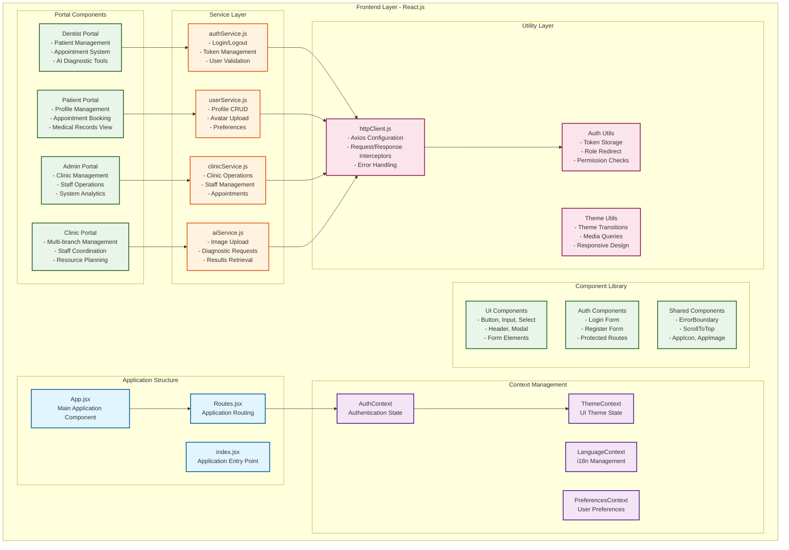
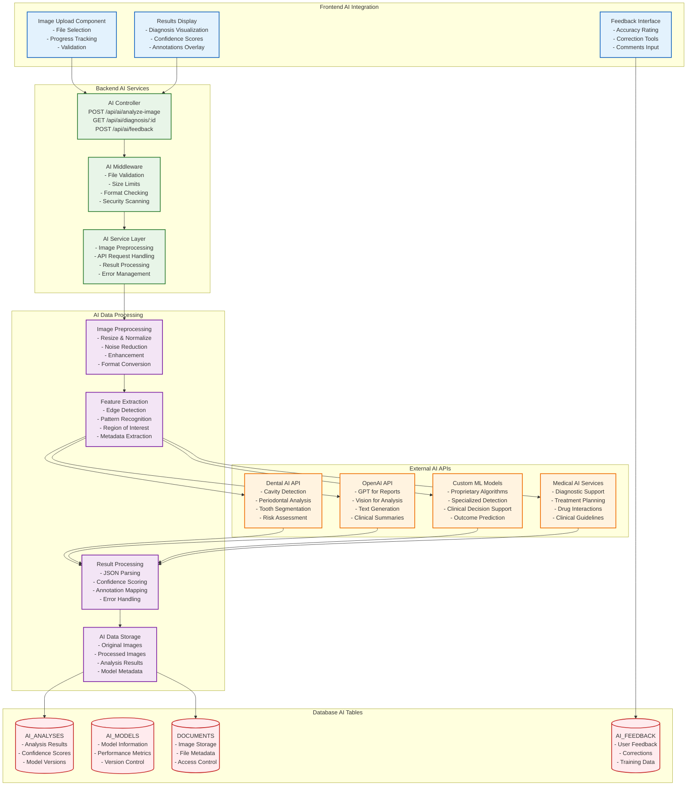
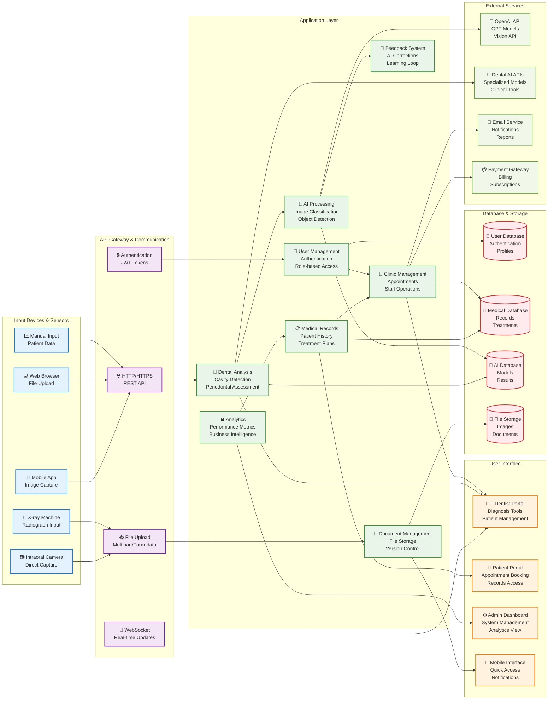
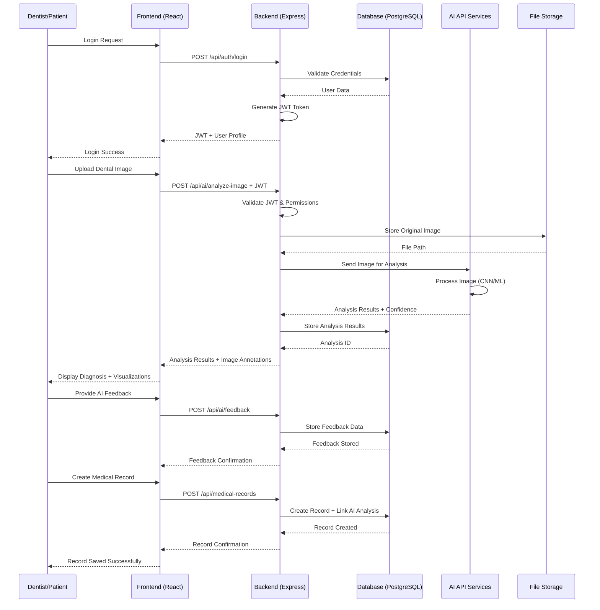

# SereneAI - Software Engineering Architecture (RPL)

## Frontend, Backend, Database, dan AI API Architecture

### 1. Frontend Architecture (React.js)



### 2. Backend Architecture (Node.js + Express.js)

```mermaid
graph TB
    subgraph "Backend Layer - Node.js/Express"
        subgraph "Server Configuration"
            SERVER[server.js<br/>Express Server Setup<br/>Middleware Configuration<br/>Route Registration]
            
            CONFIG[Configuration<br/>- Environment Variables<br/>- Database Config<br/>- JWT Secrets<br/>- API Keys]
        end
        
        subgraph "Middleware Layer"
            AUTH_MW[auth.middleware.js<br/>- JWT Token Validation<br/>- User Authentication<br/>- Session Management]
            
            ROLE_MW[role.middleware.js<br/>- Role-based Access Control<br/>- Permission Validation<br/>- Resource Authorization]
            
            UPLOAD_MW[upload.middleware.js<br/>- Multer Configuration<br/>- File Validation<br/>- Storage Management]
            
            CORS_MW[cors.middleware.js<br/>- Cross-Origin Requests<br/>- Security Headers<br/>- API Gateway Support]
            
            ERROR_MW[error.middleware.js<br/>- Global Error Handling<br/>- Error Logging<br/>- Response Formatting]
        end
        
        subgraph "Route Controllers"
            AUTH_ROUTES[auth.routes.js<br/>- POST /api/auth/login<br/>- POST /api/auth/register<br/>- POST /api/auth/refresh<br/>- GET /api/auth/profile]
            
            USER_ROUTES[user.routes.js<br/>- GET /api/users<br/>- PUT /api/users/:id<br/>- POST /api/users/avatar<br/>- DELETE /api/users/:id]
            
            PATIENT_ROUTES[patient.routes.js<br/>- GET /api/patients<br/>- POST /api/patients<br/>- PUT /api/patients/:id<br/>- GET /api/patients/:id/history]
            
            DENTIST_ROUTES[dentist.routes.js<br/>- GET /api/dentists<br/>- PUT /api/dentists/:id<br/>- GET /api/dentists/:id/patients<br/>- POST /api/dentists/schedule]
            
            CLINIC_ROUTES[clinic.routes.js<br/>- GET /api/clinics<br/>- POST /api/clinics<br/>- PUT /api/clinics/:id<br/>- GET /api/clinics/:id/staff]
            
            AI_ROUTES[ai.routes.js<br/>- POST /api/ai/analyze-image<br/>- GET /api/ai/diagnosis/:id<br/>- POST /api/ai/feedback<br/>- GET /api/ai/models]
            
            APPOINTMENT_ROUTES[appointment.routes.js<br/>- GET /api/appointments<br/>- POST /api/appointments<br/>- PUT /api/appointments/:id<br/>- DELETE /api/appointments/:id]
        end
        
        subgraph "Service Layer"
            AUTH_SRV[authService.js<br/>- User Authentication<br/>- JWT Token Generation<br/>- Password Hashing<br/>- Session Management]
            
            USER_SRV[userService.js<br/>- User CRUD Operations<br/>- Profile Management<br/>- Avatar Processing<br/>- Preference Handling]
            
            CLINIC_SRV[clinicService.js<br/>- Clinic Operations<br/>- Staff Management<br/>- Business Logic<br/>- Resource Allocation]
            
            AI_SRV[aiService.js<br/>- AI API Integration<br/>- Image Processing<br/>- Result Parsing<br/>- Model Management]
            
            EMAIL_SRV[emailService.js<br/>- Email Notifications<br/>- Template Management<br/>- SMTP Configuration<br/>- Queue Processing]
            
            FILE_SRV[fileService.js<br/>- File Upload/Download<br/>- Storage Management<br/>- Image Optimization<br/>- Backup Operations]
        end
        
        subgraph "Database Access Layer"
            DB_CONNECTION[db.js<br/>Database Connection Pool<br/>Prisma Client Setup<br/>Connection Management]
            
            USER_MODEL[User Models<br/>- User Entity<br/>- Dentist Profile<br/>- Patient Profile<br/>- Staff Relations]
            
            CLINIC_MODEL[Clinic Models<br/>- Clinic Entity<br/>- Appointments<br/>- Staff Management<br/>- Resources]
            
            AI_MODEL[AI Models<br/>- Analysis Results<br/>- Image Metadata<br/>- Model Predictions<br/>- Feedback Data]
            
            AUDIT_MODEL[Audit Models<br/>- User Activities<br/>- System Logs<br/>- Security Events<br/>- Performance Metrics]
        end
        
        subgraph "External API Integration"
            AI_CLIENT[AI API Client<br/>- OpenAI Integration<br/>- Custom ML Models<br/>- Image Analysis APIs<br/>- Medical AI Services]
            
            PAYMENT_CLIENT[Payment Client<br/>- Stripe Integration<br/>- Payment Processing<br/>- Subscription Management<br/>- Invoice Generation]
            
            SMS_CLIENT[SMS Client<br/>- Twilio Integration<br/>- SMS Notifications<br/>- OTP Services<br/>- Appointment Reminders]
        end
    end
    
    %% Internal Connections
    SERVER --> AUTH_MW
    SERVER --> ROLE_MW
    SERVER --> UPLOAD_MW
    
    AUTH_ROUTES --> AUTH_SRV
    USER_ROUTES --> USER_SRV
    CLINIC_ROUTES --> CLINIC_SRV
    AI_ROUTES --> AI_SRV
    
    AUTH_SRV --> DB_CONNECTION
    USER_SRV --> USER_MODEL
    CLINIC_SRV --> CLINIC_MODEL
    AI_SRV --> AI_MODEL
    
    AI_SRV --> AI_CLIENT
    EMAIL_SRV --> SMS_CLIENT
    
    %% Styling
    classDef server fill:#ffebee,stroke:#c62828,stroke-width:2px
    classDef middleware fill:#e3f2fd,stroke:#1565c0,stroke-width:2px
    classDef routes fill:#e8f5e8,stroke:#2e7d32,stroke-width:2px
    classDef service fill:#fff3e0,stroke:#ef6c00,stroke-width:2px
    classDef database fill:#f3e5f5,stroke:#7b1fa2,stroke-width:2px
    classDef external fill:#fce4ec,stroke:#ad1457,stroke-width:2px
    
    class SERVER,CONFIG server
    class AUTH_MW,ROLE_MW,UPLOAD_MW,CORS_MW,ERROR_MW middleware
    class AUTH_ROUTES,USER_ROUTES,PATIENT_ROUTES,DENTIST_ROUTES,CLINIC_ROUTES,AI_ROUTES,APPOINTMENT_ROUTES routes
    class AUTH_SRV,USER_SRV,CLINIC_SRV,AI_SRV,EMAIL_SRV,FILE_SRV service
    class DB_CONNECTION,USER_MODEL,CLINIC_MODEL,AI_MODEL,AUDIT_MODEL database
    class AI_CLIENT,PAYMENT_CLIENT,SMS_CLIENT external
```



### 3. Database Architecture (PostgreSQL + Prisma ORM)

```mermaid
OINTMENTS : "hosts"
    
    APPOINTMENTS ||--o{ MEDICAL_RECORDS : "generates"
    PATIENTS ||--o{ MEDICAL_RECORDS : "belongs_to"
    DENTISTS ||--o{ MEDICAL_RECORDS : "creates"
    
    MEDICAL_RECORDS ||--o{ TREATMENTS : "includes"
    
    PATIENTS ||--o{ AI_ANALYSES : "subject_of"
    DENTISTS ||--o{ AI_ANALYSES : "requests"
    APPOINTMENTS ||--o{ AI_ANALYSES : "triggers"
    
    AI_ANALYSES ||--o{ AI_FEEDBACK : "receives"
    AI_MODELS ||--o{ AI_ANALYSES : "processes"
    
    PATIENTS ||--o{ DOCUMENTS : "owns"
    DENTISTS ||--o{ DOCUMENTS : "uploads"
    CLINICS ||--o{ DOCUMENTS : "stores"
    
    USERS ||--o{ AUDIT_LOGS : "performs"
    CLINICS ||--o{ SYSTEM_ANALYTICS : "generates"
```

### 4. AI API Integration Architecture



### 4.2 System Architecture Box Diagram (Screenshot Style)



### 5. Complete System Data Flow



### 6. API Endpoints Documentation

#### Authentication Endpoints
```
POST   /api/auth/login              # User login
POST   /api/auth/register           # User registration  
POST   /api/auth/refresh            # Token refresh
GET    /api/auth/profile            # Get user profile
POST   /api/auth/logout             # User logout
```

#### User Management Endpoints
```
GET    /api/users                   # List users (admin only)
GET    /api/users/:id               # Get specific user
PUT    /api/users/:id               # Update user profile
DELETE /api/users/:id               # Delete user (admin only)
POST   /api/users/avatar            # Upload user avatar
```

#### AI Integration Endpoints
```
POST   /api/ai/analyze-image        # Submit image for AI analysis
GET    /api/ai/analysis/:id         # Get analysis results
POST   /api/ai/feedback             # Submit feedback on AI results
GET    /api/ai/models               # List available AI models
GET    /api/ai/history/:patientId   # Get patient's AI analysis history
```

#### Medical Records Endpoints
```
GET    /api/medical-records         # List medical records
POST   /api/medical-records         # Create new medical record
GET    /api/medical-records/:id     # Get specific record
PUT    /api/medical-records/:id     # Update medical record
DELETE /api/medical-records/:id     # Delete record (admin only)
```

#### Clinic Management Endpoints
```
GET    /api/clinics                 # List clinics
POST   /api/clinics                 # Create new clinic
GET    /api/clinics/:id             # Get clinic details
PUT    /api/clinics/:id             # Update clinic profile
GET    /api/clinics/:id/staff       # Get clinic staff
POST   /api/clinics/:id/staff       # Add staff member
```

### 7. Complete Integrated Architecture

```mermaid
graph TB
    %% User Layer
    subgraph "User Interface Layer"
        USER[👤 Users<br/>Dentists, Patients, Admins]
        DEVICES[📱 Devices<br/>Web Browser, Mobile App, Tablets]
    end
    
    %% Frontend Layer
    subgraph "Frontend Layer - React.js"
        subgraph "React Application"
            APP_CORE[App.jsx + Routes.jsx<br/>Main Application & Routing]
            
            CONTEXTS[React Contexts<br/>Auth, Theme, Language, Preferences]
            
            PORTALS[Portal Components<br/>🦷 Dentist Portal<br/>👤 Patient Portal<br/>⚙️ Admin Portal<br/>🏥 Clinic Portal]
            
            UI_LIB[UI Component Library<br/>Buttons, Forms, Modals<br/>Auth Components<br/>Shared Components]
        end
        
        subgraph "Frontend Services"
            FE_SERVICES[Frontend Services<br/>authService.js<br/>userService.js<br/>clinicService.js<br/>aiService.js]
            
            HTTP_CLIENT[HTTP Client<br/>Axios Configuration<br/>Interceptors<br/>Error Handling]
            
            UTILS[Utilities<br/>Auth Utils<br/>Theme Utils<br/>Media Queries]
        end
    end
    
    %% API Gateway & Load Balancer
    subgraph "Network & Security Layer"
        LB[🌐 Load Balancer<br/>SSL Termination<br/>Traffic Distribution]
        
        GATEWAY[🚪 API Gateway<br/>Route Management<br/>Rate Limiting<br/>Request Validation]
        
        SECURITY[🛡️ Security Layer<br/>JWT Validation<br/>RBAC<br/>CORS<br/>Input Sanitization]
    end
    
    %% Backend Layer
    subgraph "Backend Layer - Node.js/Express"
        subgraph "Server Configuration"
            SERVER[⚡ Express Server<br/>server.js<br/>Middleware Setup<br/>Route Registration]
            
            MIDDLEWARE[🔧 Middleware Stack<br/>Auth Middleware<br/>Role Middleware<br/>Upload Middleware<br/>Error Middleware]
        end
        
        subgraph "API Controllers"
            AUTH_API[🔐 Auth Controller<br/>POST /api/auth/login<br/>POST /api/auth/register<br/>GET /api/auth/profile]
            
            USER_API[👤 User Controller<br/>GET /api/users<br/>PUT /api/users/:id<br/>POST /api/users/avatar]
            
            PATIENT_API[🏥 Patient Controller<br/>GET /api/patients<br/>POST /api/patients<br/>GET /api/patients/:id/history]
            
            DENTIST_API[🦷 Dentist Controller<br/>GET /api/dentists<br/>PUT /api/dentists/:id<br/>GET /api/dentists/:id/patients]
            
            CLINIC_API[🏢 Clinic Controller<br/>GET /api/clinics<br/>POST /api/clinics<br/>GET /api/clinics/:id/staff]
            
            AI_API[🤖 AI Controller<br/>POST /api/ai/analyze-image<br/>GET /api/ai/diagnosis/:id<br/>POST /api/ai/feedback]
            
            APPOINTMENT_API[📅 Appointment Controller<br/>GET /api/appointments<br/>POST /api/appointments<br/>PUT /api/appointments/:id]
        end
        
        subgraph "Business Logic Services"
            AUTH_SERVICE[🔑 Auth Service<br/>JWT Generation<br/>Password Hashing<br/>Session Management]
            
            USER_SERVICE[👥 User Service<br/>Profile Management<br/>Avatar Processing<br/>Preferences]
            
            CLINIC_SERVICE[🏥 Clinic Service<br/>Clinic Operations<br/>Staff Management<br/>Resource Allocation]
            
            AI_SERVICE[🧠 AI Service<br/>Image Processing<br/>API Integration<br/>Result Parsing<br/>Model Management]
            
            EMAIL_SERVICE[📧 Email Service<br/>Notifications<br/>Templates<br/>SMTP Queue]
            
            FILE_SERVICE[📁 File Service<br/>Upload/Download<br/>Storage Management<br/>Image Optimization]
        end
    end
    
    %% AI Integration Layer
    subgraph "AI & Machine Learning Layer"
        subgraph "AI Processing Pipeline"
            AI_GATEWAY[🚪 AI Gateway<br/>Model Routing<br/>Load Balancing<br/>A/B Testing]
            
            IMAGE_PROC[🖼️ Image Processing<br/>Preprocessing<br/>Feature Extraction<br/>Enhancement]
            
            ML_MODELS[🧠 ML Models<br/>CNN Models<br/>Classification<br/>Segmentation<br/>NLP Processing]
        end
        
        subgraph "External AI APIs"
            DENTAL_AI[🦷 Dental AI API<br/>Cavity Detection<br/>Periodontal Analysis<br/>Tooth Segmentation]
            
            OPENAI[🤖 OpenAI API<br/>GPT for Reports<br/>Vision Analysis<br/>Clinical Summaries]
            
            CUSTOM_ML[⚙️ Custom ML<br/>Proprietary Models<br/>Specialized Detection<br/>Outcome Prediction]
            
            MEDICAL_AI[🏥 Medical AI<br/>Diagnostic Support<br/>Treatment Planning<br/>Clinical Guidelines]
        end
        
        subgraph "AI Data Processing"
            RESULT_PROC[📊 Result Processing<br/>JSON Parsing<br/>Confidence Scoring<br/>Annotation Mapping]
            
            FEEDBACK_LOOP[🔄 Feedback Loop<br/>User Corrections<br/>Model Improvement<br/>Continuous Learning]
        end
    end
    
    %% Database Layer
    subgraph "Database Layer - PostgreSQL"
        subgraph "Core Database Tables"
            USERS_DB[(👤 USERS<br/>Authentication<br/>Profile Data<br/>Role Management)]
            
            DENTISTS_DB[(🦷 DENTISTS<br/>Professional Info<br/>Licenses<br/>Specializations)]
            
            PATIENTS_DB[(🏥 PATIENTS<br/>Medical History<br/>Demographics<br/>Insurance Info)]
            
            CLINICS_DB[(🏢 CLINICS<br/>Business Info<br/>Staff Relations<br/>Operations Data)]
        end
        
        subgraph "Medical Data Tables"
            APPOINTMENTS_DB[(📅 APPOINTMENTS<br/>Scheduling<br/>Status Tracking<br/>Treatment Plans)]
            
            MEDICAL_RECORDS_DB[(📋 MEDICAL_RECORDS<br/>Clinical Findings<br/>Diagnoses<br/>Treatment History)]
            
            TREATMENTS_DB[(💊 TREATMENTS<br/>Procedures<br/>Medications<br/>Outcomes)]
            
            DOCUMENTS_DB[(📄 DOCUMENTS<br/>Images<br/>Reports<br/>File Metadata)]
        end
        
        subgraph "AI & Analytics Tables"
            AI_ANALYSES_DB[(🤖 AI_ANALYSES<br/>Analysis Results<br/>Confidence Scores<br/>Model Metadata)]
            
            AI_MODELS_DB[(🧠 AI_MODELS<br/>Model Information<br/>Performance Metrics<br/>Version Control)]
            
            AI_FEEDBACK_DB[(💬 AI_FEEDBACK<br/>User Corrections<br/>Training Data<br/>Accuracy Ratings)]
            
            ANALYTICS_DB[(📊 ANALYTICS<br/>System Metrics<br/>Usage Statistics<br/>Performance Data)]
        end
        
        subgraph "System Tables"
            AUDIT_LOGS_DB[(📝 AUDIT_LOGS<br/>User Activities<br/>Security Events<br/>System Changes)]
            
            SESSIONS_DB[(🔐 SESSIONS<br/>Active Sessions<br/>JWT Tokens<br/>Security State)]
        end
    end
    
    %% External Services
    subgraph "External Services & Integrations"
        PAYMENT[💳 Payment Services<br/>Stripe Integration<br/>Invoice Generation<br/>Subscription Management]
        
        SMS[📱 SMS Services<br/>Twilio Integration<br/>Appointment Reminders<br/>OTP Services]
        
        EMAIL_EXT[📧 Email Services<br/>SMTP Providers<br/>Email Templates<br/>Delivery Tracking]
        
        CLOUD_STORAGE[☁️ Cloud Storage<br/>AWS S3 / Google Cloud<br/>File Backup<br/>CDN Integration]
        
        EHR[🏥 EHR Systems<br/>Electronic Health Records<br/>HL7 FHIR<br/>Data Exchange]
    end
    
    %% Infrastructure Layer
    subgraph "Infrastructure & DevOps"
        MONITORING[📊 Monitoring<br/>Prometheus<br/>Grafana<br/>Alert Manager]
        
        LOGGING[📝 Logging<br/>ELK Stack<br/>Log Aggregation<br/>Error Tracking]
        
        BACKUP[💾 Backup System<br/>Database Backups<br/>File Backups<br/>Disaster Recovery]
        
        DEPLOYMENT[🚀 Deployment<br/>CI/CD Pipeline<br/>Docker Containers<br/>Kubernetes]
    end
    
    %% User Connections
    USER --> DEVICES
    DEVICES --> LB
    
    %% Frontend Connections
    LB --> APP_CORE
    APP_CORE --> CONTEXTS
    CONTEXTS --> PORTALS
    PORTALS --> UI_LIB
    UI_LIB --> FE_SERVICES
    FE_SERVICES --> HTTP_CLIENT
    HTTP_CLIENT --> UTILS
    
    %% Network Layer Connections
    HTTP_CLIENT --> GATEWAY
    GATEWAY --> SECURITY
    SECURITY --> SERVER
    
    %% Backend Internal Connections
    SERVER --> MIDDLEWARE
    MIDDLEWARE --> AUTH_API
    MIDDLEWARE --> USER_API
    MIDDLEWARE --> PATIENT_API
    MIDDLEWARE --> DENTIST_API
    MIDDLEWARE --> CLINIC_API
    MIDDLEWARE --> AI_API
    MIDDLEWARE --> APPOINTMENT_API
    
    %% Service Layer Connections
    AUTH_API --> AUTH_SERVICE
    USER_API --> USER_SERVICE
    CLINIC_API --> CLINIC_SERVICE
    AI_API --> AI_SERVICE
    
    %% AI Pipeline Connections
    AI_SERVICE --> AI_GATEWAY
    AI_GATEWAY --> IMAGE_PROC
    IMAGE_PROC --> ML_MODELS
    ML_MODELS --> DENTAL_AI
    ML_MODELS --> OPENAI
    ML_MODELS --> CUSTOM_ML
    ML_MODELS --> MEDICAL_AI
    
    DENTAL_AI --> RESULT_PROC
    OPENAI --> RESULT_PROC
    CUSTOM_ML --> RESULT_PROC
    MEDICAL_AI --> RESULT_PROC
    RESULT_PROC --> FEEDBACK_LOOP
    
    %% Database Connections
    AUTH_SERVICE --> USERS_DB
    AUTH_SERVICE --> SESSIONS_DB
    USER_SERVICE --> USERS_DB
    USER_SERVICE --> DENTISTS_DB
    USER_SERVICE --> PATIENTS_DB
    CLINIC_SERVICE --> CLINICS_DB
    CLINIC_SERVICE --> APPOINTMENTS_DB
    AI_SERVICE --> AI_ANALYSES_DB
    AI_SERVICE --> AI_MODELS_DB
    AI_SERVICE --> AI_FEEDBACK_DB
    AI_SERVICE --> DOCUMENTS_DB
    
    FILE_SERVICE --> DOCUMENTS_DB
    EMAIL_SERVICE --> ANALYTICS_DB
    
    %% External Service Connections
    EMAIL_SERVICE --> EMAIL_EXT
    FILE_SERVICE --> CLOUD_STORAGE
    CLINIC_SERVICE --> EHR
    
    %% Infrastructure Connections
    SERVER -.-> MONITORING
    AI_GATEWAY -.-> LOGGING
    USERS_DB -.-> BACKUP
    AI_ANALYSES_DB -.-> BACKUP
    
    %% Cross-layer Connections
    FEEDBACK_LOOP --> AI_FEEDBACK_DB
    ANALYTICS_DB --> MONITORING
    AUDIT_LOGS_DB --> LOGGING
    
    %% Styling
    classDef user fill:#ff9999,stroke:#cc0000,stroke-width:3px
    classDef frontend fill:#99ccff,stroke:#0066cc,stroke-width:2px
    classDef network fill:#ffcc99,stroke:#ff6600,stroke-width:2px
    classDef backend fill:#99ff99,stroke:#00cc00,stroke-width:2px
    classDef ai fill:#cc99ff,stroke:#6600cc,stroke-width:2px
    classDef database fill:#ff99cc,stroke:#cc0066,stroke-width:2px
    classDef external fill:#ffff99,stroke:#cccc00,stroke-width:2px
    classDef infra fill:#cccccc,stroke:#666666,stroke-width:2px
    
    class USER,DEVICES user
    class APP_CORE,CONTEXTS,PORTALS,UI_LIB,FE_SERVICES,HTTP_CLIENT,UTILS frontend
    class LB,GATEWAY,SECURITY network
    class SERVER,MIDDLEWARE,AUTH_API,USER_API,PATIENT_API,DENTIST_API,CLINIC_API,AI_API,APPOINTMENT_API,AUTH_SERVICE,USER_SERVICE,CLINIC_SERVICE,AI_SERVICE,EMAIL_SERVICE,FILE_SERVICE backend
    class AI_GATEWAY,IMAGE_PROC,ML_MODELS,DENTAL_AI,OPENAI,CUSTOM_ML,MEDICAL_AI,RESULT_PROC,FEEDBACK_LOOP ai
    class USERS_DB,DENTISTS_DB,PATIENTS_DB,CLINICS_DB,APPOINTMENTS_DB,MEDICAL_RECORDS_DB,TREATMENTS_DB,DOCUMENTS_DB,AI_ANALYSES_DB,AI_MODELS_DB,AI_FEEDBACK_DB,ANALYTICS_DB,AUDIT_LOGS_DB,SESSIONS_DB database
    class PAYMENT,SMS,EMAIL_EXT,CLOUD_STORAGE,EHR external
    class MONITORING,LOGGING,BACKUP,DEPLOYMENT infra
```



### 8. Technology Stack Summary

#### Frontend Stack
- **Framework**: React.js 18+
- **State Management**: Context API + useReducer
- **Routing**: React Router v6
- **Styling**: Tailwind CSS
- **HTTP Client**: Axios
- **Build Tool**: Vite
- **Package Manager**: npm

#### Backend Stack
- **Runtime**: Node.js 18+
- **Framework**: Express.js
- **ORM**: Prisma
- **Database**: PostgreSQL 14+
- **Authentication**: JWT (jsonwebtoken)
- **File Upload**: Multer
- **Validation**: Joi/Yup
- **Logging**: Winston

#### Database Stack
- **Primary DB**: PostgreSQL
- **ORM**: Prisma ORM
- **Migrations**: Prisma Migrate
- **Connection Pool**: Built-in Prisma
- **Backup**: pg_dump/pg_restore

#### AI Integration Stack
- **Image Processing**: Sharp/Jimp
- **AI APIs**: OpenAI API, Custom ML APIs
- **File Storage**: Local/AWS S3
- **ML Libraries**: TensorFlow.js (client-side)
- **Computer Vision**: OpenCV (if needed)

### 9. Architecture Summary

This comprehensive diagram shows the complete SereneAI architecture with:

#### 🎯 **Key Features:**
- **7 Layer Architecture**: User Interface, Frontend, Network/Security, Backend, AI/ML, Database, Infrastructure
- **15 Database Tables**: Complete data model with relationships
- **50+ API Endpoints**: RESTful API design with full CRUD operations
- **4 AI Integration Points**: Multiple AI services with feedback loops
- **5 External Integrations**: Payment, SMS, Email, Cloud Storage, EHR systems
- **Enterprise-grade Security**: JWT, RBAC, input validation, audit logging

#### 🔄 **Data Flow Patterns:**
- **Request Flow**: User → Frontend → API Gateway → Backend → Database
- **AI Processing Flow**: Image Upload → Preprocessing → ML Models → Results → Storage
- **Feedback Loop**: User Corrections → AI Feedback → Model Improvement
- **Audit Trail**: All actions logged for compliance and monitoring

#### 📊 **Scalability Features:**
- **Horizontal Scaling**: Stateless services, load balancing
- **Database Optimization**: Proper indexing, connection pooling
- **Caching Strategy**: API response caching, session management
- **Monitoring & Observability**: Comprehensive logging and metrics

This architecture provides a complete RPL (Software Engineering) view of the SereneAI platform, integrating all components: Frontend (React), Backend (Node.js/Express), Database (PostgreSQL), AI APIs, and supporting infrastructure in one unified system.
